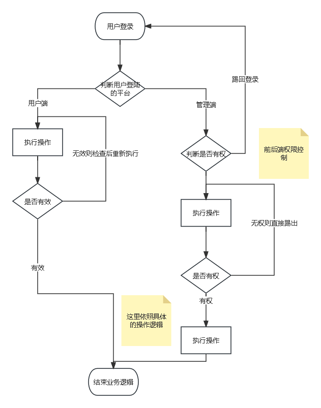
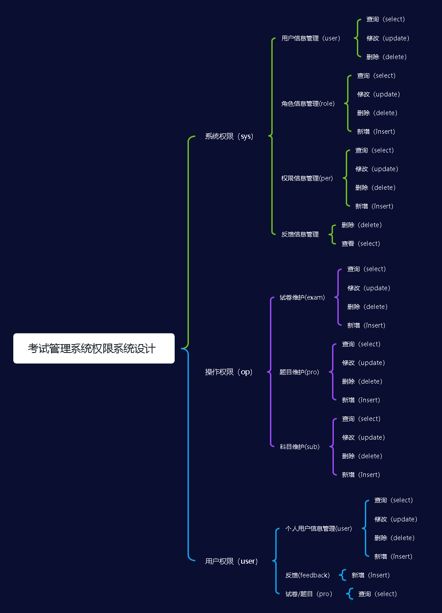
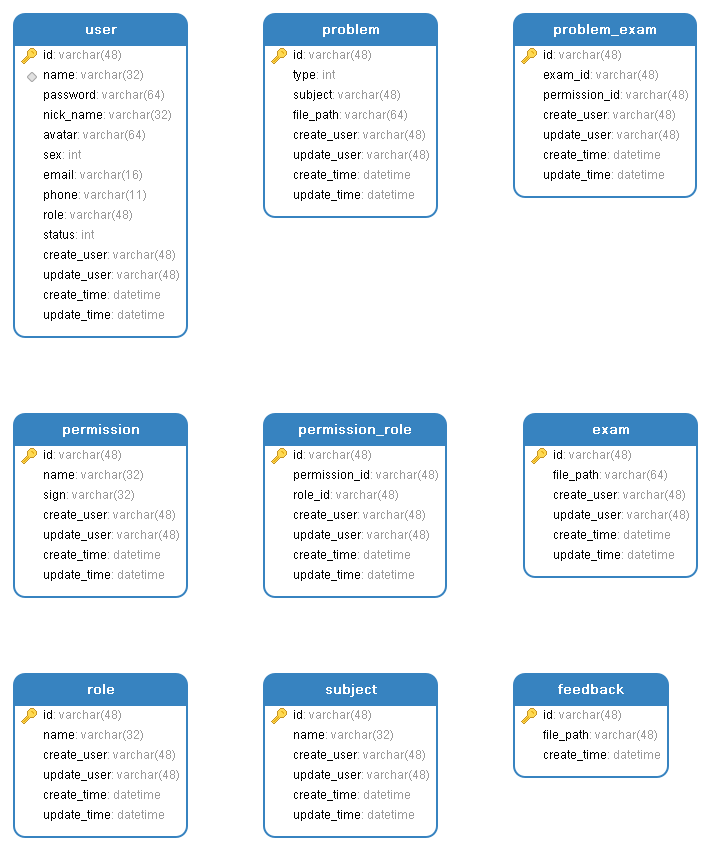
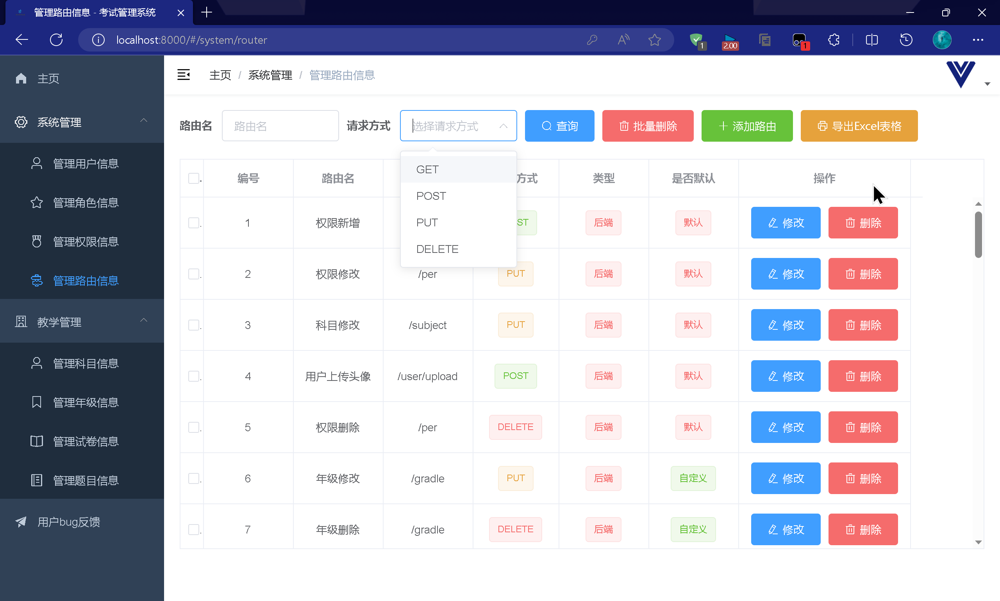
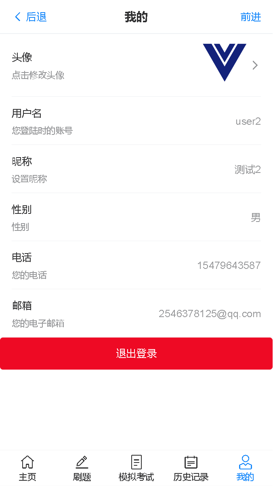
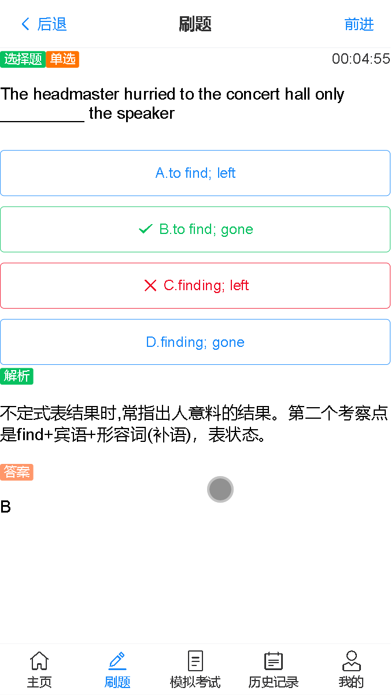
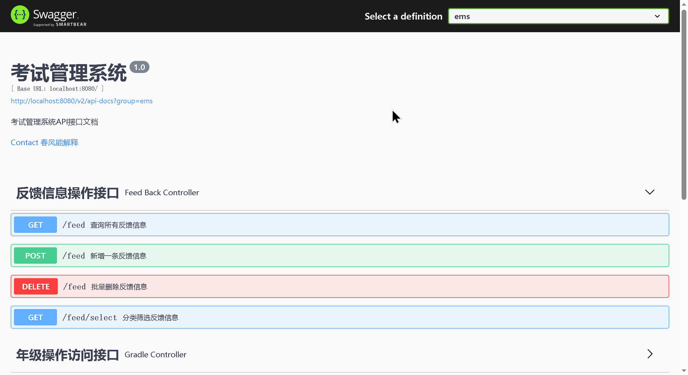

# 考试管理系统


[](https://www.cnblogs.com/cfnjs)

[](https://gitee.com/cfnjs20020602/EMSystem)[](https://gitee.com/cfnjs20020602/EMSystem)

# 目录

- [考试管理系统](#考试管理系统)
- [目录](#目录)
- [一、项目简介](#一项目简介)
  - [1.背景](#1背景)
  - [2.简介](#2简介)
- [二、技术与优势](#二技术与优势)
  - [1.使用的主流技术](#1使用的主流技术)
  - [2.业务执行流程](#2业务执行流程)
  - [3.权限管理机制](#3权限管理机制)
  - [4.数据库表设计](#4数据库表设计)
  - [5.丰富的管理菜单(后台)](#5丰富的管理菜单后台)
  - [6.精简的用户界面(前台)](#6精简的用户界面前台)
  - [7.API 接口自动生成](#7api-接口自动生成)
- [三、使用方法与安装教程](#三使用方法与安装教程)
  - [必要条件](#必要条件)
  - [1.克隆仓库](#1克隆仓库)
  - [2.项目构建](#2项目构建)
    - [后端](#后端)
    - [前端](#前端)
  - [3.项目运行](#3项目运行)
    - [后端](#后端-1)
    - [前端](#前端-1)
  - [4.查看](#4查看)
    - [后端](#后端-2)
    - [前端](#前端-2)
- [四、项目已知的部分未修复的 BUG](#四项目已知的部分未修复的-bug)
- [五、特别鸣谢](#五特别鸣谢)
  - [开发框架及生态的缔造者们](#开发框架及生态的缔造者们)
  - [以及广大优秀开发者们](#以及广大优秀开发者们)
- [六、开发日志(实时更新)](#六开发日志实时更新)

# 一、项目简介


## 1.背景

在教务管理系统二代的基础上进行了修改，将原本的难以维护的微服务架构转变为一般的 SpringBoot
单体项目，减少了服务器内存占用，避免多个模块的启动导致服务器内存溢出，对渣机友好，具体原因可查阅[总结.md](summary.md)

## 2.简介

考试管理系统(Exam Management System)，可以实现考试模拟，考试管理、成员管理，另外，该系统有着比较完善的权限管理机制，可在后台精准控制前后端路由权限

# 二、技术与优势

## 1.使用的主流技术

后端：SpringBoot+SpringSecurity+MyBatis+Redis+Gradle

前端：Vue-Admin-Template(后台)+Vue-Mobile-Template(前台)

## 2.业务执行流程



## 3.权限管理机制



## 4.数据库表设计



## 5.丰富的管理菜单(后台)



## 6.精简的用户界面(前台)





## 7.API 接口自动生成



# 三、使用方法与安装教程

## 必要条件

1. JDK1.8 及其以上(必需)

2. IDEA 或其他开发工具(若只求运行可选)

3. Vue 脚手架 2 及其以上(必需)

4. Gradle 编译工具(必需)

5. Git 工具(可选,可直接在 Gitee 或 GitHub 下载仓库)

6. MySQL5.7 及其以上(必需)
7. 一台内存 8GB 以上的电脑(可选)

## 1.克隆仓库

```bash
git clone https://gitee.com/cfnjs20020602/EMSystem
```

## 2.项目构建

### 后端

进入项目并打开命令行

```bash
gradlew.bat
```

也可使用 IDEA 等开发工具，打开项目即可自动开始构建

### 前端

进入项目并打开命令行或使用 VSCode 开发工具

```bash
npm install
```

## 3.项目运行

### 后端

在项目 bin 目录下找到 xxx.jar 打包好的 jar 文件

```bash
java -jar xxx.jar
```

或在 IDEA 开发工具打开 com/chunfeng/EmSystemApplication.java 的 main 方法运行

### 前端

进入项目并打开命令行或使用 VSCode 开发工具

```bash
npm run dev
```

## 4.查看

### 后端

查看控制台，是否出现

```bash
Tomcat started on port(s): 8080 (http) with context path ''
```

若出现则开服成功!

### 前端

待前后端服务器启动后，在浏览器输入

```apl
http://localhost:8000
```

如果能进入登录界面则开服成功!

# 四、项目已知的部分未修复的 BUG

1. 后台在修改路由表时，添加的路由进行第一次修改必然失败，第二次才能成功
2. 当后端启动时，如果前端未删除 Cooke，则或无限弹窗直至浏览器卡死

# 五、特别鸣谢

## 开发框架及生态的缔造者们

[Spring](https://spring.io/)

[MyBatis](https://mybatis.net.cn/)

[Redis](https://redis.io/)

[Swagger](https://swagger.io/)

[Vue.js](https://cn.vuejs.org/)

[Element-UI](https://element.eleme.cn/#/zh-CN)

[Vant](https://youzan.github.io/vant-weapp/#/home)

[Axios](https://www.axios-http.cn/)

[vue-element-admin](https://panjiachen.github.io/vue-element-admin-site/zh/guide/)

[vue-mobile-template](https://gitee.com/liupeiqiang/vue-mobile-template)

## 以及广大优秀开发者们

[Java 实现通配符匹配](https://www.jianshu.com/p/fc1eb5bce62d)

[error-page](https://gitee.com/cloudResource/error-page)

[SpringSecurity 框架教程-三更](https://www.bilibili.com/video/BV1mm4y1X7Hc/)

# 六、开发日志(实时更新)

commit 15a8f1051a44dd33f501551154d71be8872a4803 (HEAD -> master, Gitee/master, GitHub/master)
Author: 梦途 <2516649281@qq.com>  
Date: Sun Sep 10 16:37:45 2023 +0800

    用户端做题页面大致完成，题目正确与否功能判断尚未完成，修复了一些bug

commit 629f15c470b7650647843da367ac286106657b44
Author: 梦途 <2516649281@qq.com>
Date: Sun Sep 10 13:38:54 2023 +0800

    用户端做题页面大致完成，题目正确与否功能判断尚未完成，修复了一些bug

commit 5b7128e1936a45289d8bc45e7a5489b107b2b576
Author: 梦途 <2516649281@qq.com>
Date: Sat Sep 9 21:31:12 2023 +0800

    用户端题目查看与搜索功能实现，题目练习页面开始开发，修复了部分bug

commit b78ad3d58a5083f49d93bb79b15a9ab7bcbf1aa9
Author: 梦途 <2516649281@qq.com>
Date: Sat Sep 9 19:15:47 2023 +0800

    前端菜单页新增刷题、模拟和历史记录模块，刷题模块实现了分类搜索

commit 2bdde8e41d16df81e5514a9c4bebcfff4fd75afc
Author: 梦途 <2516649281@qq.com>
Date: Wed Sep 6 21:53:37 2023 +0800

    后端试卷历史、题目历史接口开发完成

commit 5844a9d882dc107be76b4919b338074a77a6f570
Author: 梦途 <2516649281@qq.com>
Date: Tue Sep 5 21:41:40 2023 +0800

    README.md日志更新

commit 54bae58260347030e985b5c71a3abfa514056597
Author: 梦途 <2516649281@qq.com>
Date: Tue Sep 5 21:38:46 2023 +0800

    用户个人信息查询页面完成，后端用户历史记录开发，修复了一些潜在的bug

commit d9be9f1dda59de5772e52ac7f6d0ee72e219a34b
Merge: 3e35a17 ea75e91
Author: 梦途 <2516649281@qq.com>
Date: Mon Sep 4 22:32:07 2023 +0800

    Merge branch 'master' of https://gitee.com/cfnjs20020602/EMSystem

    # Conflicts:
    #       README.md
    #       summary.md

commit 3e35a173e3afda345ef36222d2246df9e739df01
Author: 梦途 <2516649281@qq.com>
Date: Mon Sep 4 22:01:28 2023 +0800

    用户端登录及公共页面完成

commit 1383e0e83092b372e5042b2c63004cd7c5c3f54a
Author: 梦途 <2516649281@qq.com>
Date: Mon Sep 4 20:58:34 2023 +0800

    用户端登录及公共页面完成

commit f5ac27e2771c3835cf042e9d8c8e7aa4818a7b73
Author: 梦途 <2516649281@qq.com>
Date: Sun Aug 13 12:26:33 2023 +0800

    导入用户端项目模板，用户端正式开始开发

commit ea75e9133d1b621281e3096e6437ecc784ca408d
Author: 梦途 <2516649281@qq.com>
Date: Mon Sep 4 22:01:28 2023 +0800

    用户端登录及公共页面完成

commit f64942ff2498b90d32de1d5f370d3648f167372a
Author: 梦途 <2516649281@qq.com>
Date: Mon Sep 4 20:58:34 2023 +0800

    用户端登录及公共页面完成

commit 001473469944d99433a0af4e8d06274d41b0fd68
Author: 梦途 <2516649281@qq.com>
Date: Sun Aug 13 12:26:33 2023 +0800

    导入用户端项目模板，用户端正式开始开发

commit 99c1c456d2ead84a7ad5b17d1a5f08ca942f49e9
Author: 梦途 <2516649281@qq.com>
Date: Sun Aug 13 12:11:19 2023 +0800

    仓库维护

commit 5a816bb5ba86f4e49f2b2cf35c10c2b6515de62f
Merge: 93c0f35 0e7d619
Author: 梦途 <2516649281@qq.com>
Date: Sat Aug 12 12:36:17 2023 +0800

    Merge branch 'master' of https://gitee.com/cfnjs20020602/EMSystem

    # Conflicts:
    #       README.md

commit 93c0f350f76a9e3160e07b04a4211a93f958b10d
Author: 梦途 <2516649281@qq.com>
Date: Sat Aug 12 12:32:46 2023 +0800

    README文件新增鸣谢名单，新增总结md

commit 0e7d6193afef70c1713f4831aecc88276090c4ba
Author: 梦途 <2516649281@qq.com>
Date: Fri Aug 11 19:47:13 2023 +0800

    README文件修改

commit c526b65637f86ae9e2dc7257bae3d8989d445a66
Author: 梦途 <2516649281@qq.com>
Date: Fri Aug 11 19:30:45 2023 +0800

    README文件修改

commit 32d368c930c452207598721c283c4c8bf1f06e5d
Author: 梦途 <2516649281@qq.com>
Date: Fri Aug 11 19:21:59 2023 +0800

    README文件修改

commit 79120d93e79f6a8448a2c17adbb715a62280b9c4
Author: 梦途 <2516649281@qq.com>
Date: Fri Aug 11 19:15:19 2023 +0800

    MD文件创建

commit ee10275eb1499ec075cd64565313204f39d5c382
Author: 梦途 <2516649281@qq.com>
Date: Fri Aug 11 14:59:10 2023 +0800

    更新了文档和资源

commit 4d1ae337f2f8cd228366256291aa04dc6eec2f39
Author: 梦途 <2516649281@qq.com>
Date: Fri Aug 11 14:58:06 2023 +0800

    更新了文档和资源

commit 7b30ce70e9a425447c7b3abcacb9ce2821ded6a6
Author: 梦途 <2516649281@qq.com>
Date: Fri Aug 11 09:53:07 2023 +0800

    前端后台基本完成，遗留了一个bug

commit f6d412a4bedcf51ed4df7fef6875297889ed533c
Author: 梦途 <2516649281@qq.com>
Date: Thu Aug 10 20:22:03 2023 +0800

    前端试卷绑定与维护功能实现，后端修复了部分bug，优化了部分业务逻辑

commit 9eeb4861b8840caf7e439cd4099e655a0362749e
Author: 梦途 <2516649281@qq.com>
Date: Thu Aug 10 13:09:51 2023 +0800

    用户头像上传功能完成，后台主页完成

commit ccb5f794c38d2a8ec8ded7335f9f83d4c6e63a7b
Author: 梦途 <2516649281@qq.com>
Date: Wed Aug 9 19:29:33 2023 +0800

    前后端代码优化，修复了前端报错的bug，优化了数据绑定逻辑

commit 2cbdaebdedb5402ab591ca1c9b0f0296c9052af6
Author: 梦途 <2516649281@qq.com>
Date: Mon Aug 7 11:17:24 2023 +0800

    后端代码优化，删除了三个赘余的控制类，调整了关系表之间的修改、删除和查询逻辑

commit dfa8e4e72940cbfe39d60af25ba49b6098da804c
Author: 梦途 <2516649281@qq.com>
Date: Sun Aug 6 17:39:49 2023 +0800

    题库修改功能实现，后端代码优化，新增年级实体，并绑定到题库，题库分类更加丰富

commit 20d797d352cc397f1750de3752d7cfb27a2e7694
Author: 梦途 <2516649281@qq.com>
Date: Sat Aug 5 18:30:37 2023 +0800

    题目新增功能实现，修复了一些潜在的bug，优化前后端代码

commit c75e82b613d483f4bbf188a07f3514d3284939e2
Author: 梦途 <2516649281@qq.com>
Date: Sat Aug 5 09:24:56 2023 +0800

    后端美化，新增自定义错误页面，控制台显示更改

commit 40ee7f83e46aa2183c2889cefa7759c6eeb40615
Author: 梦途 <2516649281@qq.com>
Date: Fri Aug 4 19:33:42 2023 +0800

    后端Swagger由2.0升级到3.0，删除了SpringSecurity原本的打印处理对象，由最新的全局打印对象代替

commit 6aadd9fe24a4022211acbdf5e8a247bb6bb1a772
Author: 梦途 <2516649281@qq.com>
Date: Fri Aug 4 19:22:25 2023 +0800

    前后端后端修复部分bug，后端新增全局异常处理类，所有的异常都将以统一的JSON格式返回

commit 330b8d68f94543bb99e638956165d90d06812ad5
Author: 梦途 <2516649281@qq.com>
Date: Thu Aug 3 12:29:05 2023 +0800

    前后端代码优化，后端修复了部分bug，添加了API接口文档和JavaDoc文档

commit 57b479bf21d2698450faf381f9a1cd9dfa319b67
Author: 梦途 <2516649281@qq.com>
Date: Wed Aug 2 14:07:31 2023 +0800

    后端动态权限完成，后端代码优化，前后端均修复了一些bug

commit b499e189c63fd19b4eaeeac8d6812c0e71682a31
Author: 梦途 <2516649281@qq.com>
Date: Tue Aug 1 15:38:42 2023 +0800

    后端全局事务处理完成，项目代码优化

commit ae934ef275b4085fb8cc1b7bab94057acb8e99d7
Author: 梦途 <2516649281@qq.com>
Date: Mon Jul 31 19:26:29 2023 +0800

    前端路由和权限绑定基本完成，遗留部分bug，后端代码优化

commit 8b64f0a4e29d8e5e4011edc274a52a655717dd83
Author: 梦途 <2516649281@qq.com>
Date: Sun Jul 30 20:50:23 2023 +0800

    后端权限系统基本完成，前端路由管理完成，权限管理新增路由绑定

commit 3462bcb03db11de25dc8aa64e7c416027903cf2b
Author: 梦途 <2516649281@qq.com>
Date: Sun Jul 30 13:01:41 2023 +0800

    后端权限系统大改，增加路由表及其关系表，SpringSecurity开始向动态权限过渡，前端科目管理完成，前后端代码微调优化

commit 29a5e2dae198eed51d32fa6bbfa834c5770c9f52
Author: 梦途 <2516649281@qq.com>
Date: Sun Jul 30 11:17:49 2023 +0800

    后端权限系统大改，增加路由表及其关系表，SpringSecurity开始向动态权限过渡，前端科目管理完成，前后端代码微调优化

commit 01a3d726d520d161e32278905eb6e610667b4fd2
Author: 梦途 <2516649281@qq.com>
Date: Sat Jul 29 18:57:16 2023 +0800

    后端代码优化和微调，前端权限管理页完成，新增Excel导出功能，前端代码优化

commit 3df0a5512555b801b5e85362cef4aeb1da788ddd
Author: 梦途 <2516649281@qq.com>
Date: Fri Jul 28 16:53:18 2023 +0800

    角色添加、删除、修改逻辑完成，后端微调，修复了nginx代理导致RequestBody无法识别的bug

commit 0ccd6f7e33771e20d67c95aed1ff6a7b5a05376d
Author: 梦途 <2516649281@qq.com>
Date: Fri Jul 28 16:52:23 2023 +0800

    角色添加、删除、修改逻辑完成，后端微调，修复了nginx代理导致RequestBody无法识别的bug

commit 4682ec29ccd5aa50ac3a66f77fcf5ff0c36e7476
Author: 梦途 <2516649281@qq.com>
Date: Fri Jul 28 16:49:00 2023 +0800

    角色添加、删除、修改逻辑完成，后端微调，修复了nginx代理导致RequestBody无法识别的bug

commit bba4d2d3c2e7ed8c0d71d04ed48ef732c5eded88
Author: 梦途 <2516649281@qq.com>
Date: Fri Jul 28 16:46:21 2023 +0800

    角色添加、删除、修改逻辑完成，后端微调，修复了nginx代理导致RequestBody无法识别的bug

commit 73751b0e00afdf72d4bb79d160990d7c4e2dd490
Author: 梦途 <2516649281@qq.com>
Date: Fri Jul 28 10:20:21 2023 +0800

    用户删除与退出登录功能实现，项目加入GitHub

commit 5751800a179e5b4873b6e4ba6dba841d8a0854d7
Author: 梦途 <2516649281@qq.com>
Date: Thu Jul 27 20:27:18 2023 +0800

    修复了后端请求卡死的bug，前端用户修改和搜索功能实现

commit 6d555a2bf4379d97ce9aead85db4692e581325b4
Author: 梦途 <2516649281@qq.com>
Date: Wed Jul 26 13:51:56 2023 +0800

    用户头像功能实现

commit 6ca17168a87cfc594e2e5e636dea3a9b7f8fe5da
Author: 梦途 <2516649281@qq.com>
Date: Tue Jul 25 14:45:19 2023 +0800

    前端导入完成，用户登录功能基本实现，后端代码微调

commit e920b9515f5c21587f505313965425899bd7de59
Author: 梦途 <2516649281@qq.com>
Date: Tue Jul 25 12:07:07 2023 +0800

    后端项目基本完成，前端管理端开始开发

commit 879cf03adf0cc0bf979afbede723a7d6aa4f4275
Author: 梦途 <2516649281@qq.com>
Date: Sun Jul 23 11:01:46 2023 +0800

    后端项目基本完成，前端管理端开始开发

commit 3a8972684bfcd117c6541e8545f41196600a8e80
Author: 梦途 <2516649281@qq.com>
Date: Sun Jul 23 10:47:50 2023 +0800

    后端项目基本完成，前端管理端开始开发

commit 2467c434eabbfe13d1b7ca4cbda46e9e5aa7c900
Merge: b768605 e1e5937
Author: 梦途 <2516649281@qq.com>
Date: Sun Jul 23 10:41:14 2023 +0800

    '仓库维护'

commit b768605d66e312f271e52f4ed58cb5b58141df65
Author: 梦途 <2516649281@qq.com>
Date: Sun Jul 23 10:37:04 2023 +0800

    后端项目基本完成，前端管理端开始开发

commit e1e5937082cf216c5a23395c7e70feed82957bdb
Author: 梦途 <2516649281@qq.com>
Date: Sun Jul 23 10:00:43 2023 +0800

    后端项目基本完成，前端管理端开始开发

commit 4da2943f6dd49272f6e94ec6366cd6a1b1b5628d
Author: 梦途 <2516649281@qq.com>
Date: Sat Jul 22 13:58:29 2023 +0800

    部分代码进行了微调，各接口添加权限菜单，数据库中添加了31个默认权限

commit a2e20bc4ca54be2f10ea3b4ff68c362319e3216b
Author: 梦途 <2516649281@qq.com>
Date: Sat Jul 22 13:58:21 2023 +0800

    部分代码进行了微调，各接口添加权限菜单，数据库中添加了31个默认权限

commit ead45e28d417dde4b7d9e792a22e5b25b776a694
Author: 梦途 <2516649281@qq.com>
Date: Fri Jul 21 18:24:09 2023 +0800

    业务层基本完成，数据库和数据层微调，加入了Swagger用于制作接口文档，控制层基本完成

commit 21d735b16c7b0d0226d3962443c06fc11888feb8
Author: 梦途 <2516649281@qq.com>
Date: Fri Jul 21 17:50:06 2023 +0800

    业务层基本完成，数据库和数据层微调，加入了Swagger用于制作接口文档，控制层基本完成

commit fb38440bf8dad42369b67b1a31795ea1b8e96a5c
Author: 梦途 <2516649281@qq.com>
Date: Wed Jul 19 20:52:41 2023 +0800

    为每个实体类添加可序列化UID，开始开发文件操作工具

commit 39631a0eb2551da3d957d45760470b32d06307df
Author: 梦途 <9821120+cfnjs20020602@user.noreply.gitee.com>
Date: Mon Jul 17 12:21:38 2023 +0000

    添加许可证，为开源做准备

    Signed-off-by: 梦途 <9821120+cfnjs20020602@user.noreply.gitee.com>

commit c8c8693d2ee1edfca3ff5e7584d66ba52acf27d7
Author: 梦途 <2516649281@qq.com>
Date: Mon Jul 17 20:08:38 2023 +0800

    数据层基本完成，微调数据库，添加了两个关系表，优化了部分代码

commit fe762b5dc423ba527d007476e5416514c2d70f42
Author: 梦途 <2516649281@qq.com>
Date: Sun Jul 16 19:30:15 2023 +0800

    数据层基本完成，微调数据库，添加了两个关系表，优化了部分代码

commit 2e10e1451304ead60b8a822069fd14e827609298
Author: 梦途 <2516649281@qq.com>
Date: Sun Jul 16 19:21:59 2023 +0800

    数据层基本完成，微调数据库，添加了两个关系表，优化了部分代码

commit 8554ff4b4dd64f60a3f32765591082f9902e234d
Author: 梦途 <2516649281@qq.com>
Date: Sat Jul 15 12:01:57 2023 +0800

    数据库调整，用户登录与注册功能基本实现，引入SpringSecurity，其余持久层Mapper完成

commit bc6c4246ab62bf1b73385d08d451235416b41d50
Author: 梦途 <2516649281@qq.com>
Date: Fri Jul 14 15:46:50 2023 +0800

    数据库更新，添加权限列表

commit dc7859662fbd1c333c905214d05a32b45d3c9a22
Author: 梦途 <2516649281@qq.com>
Date: Fri Jul 14 15:40:37 2023 +0800

    数据库更新，添加权限列表
