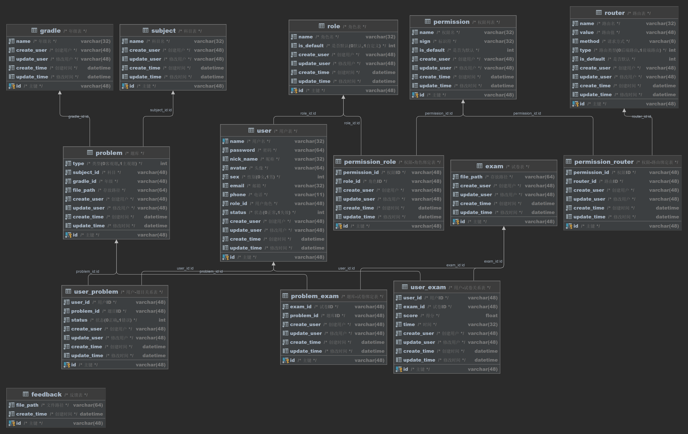

# 考试管理系统


[](https://www.cnblogs.com/cfnjs)

[](https://gitee.com/cfnjs20020602/lerun2)[](https://gitee.com/cfnjs20020602/lerun2)

# 目录

[toc]

# 一、项目简介


## 1.背景

在教务管理系统二代的基础上进行了修改，将原本的难以维护的微服务架构转变为一般的SpringBoot单体项目，减少了服务器内存占用，避免多个模块的启动导致服务器内存溢出，对渣机友好，具体原因可查阅[总结.md](summary.md)

## 2.简介

考试管理系统(Exam Management  System)，可以实现考试模拟，考试管理、成员管理，另外，该系统有着比较完善的权限管理机制，可在后台精准控制前后端路由权限

# 二、技术与优势

## 1.使用的主流技术

后端：SpringBoot+SpringSecurity+MyBatis+Redis+Gradle

前端：Vue-Admin-Template(后台)

## 2.业务执行流程


## 3.权限管理机制


## 4.数据库表设计



## 5.丰富的管理菜单(后台)


## 6.API接口自动生成


# 三、使用方法与安装教程

## 必要条件

1. JDK1.8及其以上(必需)

2. IDEA或其他开发工具(若只求运行可选)

3. Vue脚手架2及其以上(必需)

4. Gradle编译工具(必需)

5. Git工具(可选,可直接在Gitee或GitHub下载仓库)

6. MySQL5.7及其以上(必需)
7. 一台内存8GB以上的电脑(可选)

## 1.克隆仓库

```bash
git clone https://gitee.com/cfnjs20020602/EMSystem
```

## 2.项目构建

### 后端

进入项目并打开命令行

```bash
./gradlew
```

也可使用IDEA等开发工具，打开项目即可自动开始构建

### 前端

进入项目并打开命令行或使用VSCode开发工具

```bash
npm install
```

## 3.项目运行

### 后端

在项目bin目录下找到xxx.jar打包好的jar文件

```bash
java -jar xxx.jar
```

或在IDEA开发工具打开com/chunfeng/EmSystemApplication.java的main方法运行

### 前端

进入项目并打开命令行或使用VSCode开发工具

```bash
npm run dev
```

## 4.查看

### 后端

查看控制台，是否出现

```bash
Tomcat started on port(s): 8080 (http) with context path ''
```

若出现则开服成功!

### 前端

待前后端服务器启动后，在浏览器输入

```apl
http://localhost:8000
```

如果能进入登录界面则开服成功!

# 四、项目已知的部分未修复的BUG

1. 后台在修改路由表时，添加的路由进行第一次修改必然失败，第二次才能成功
2. 当后端启动时，如果前端未删除Cooke，则或无限弹窗直至浏览器卡死

# 五、开发日志

2023-08-11 14:59:10 +0800 , 更新了文档和资源
2023-08-11 14:58:06 +0800 , 更新了文档和资源
2023-08-11 09:53:07 +0800 , 前端后台基本完成，遗留了一个bug
2023-08-10 20:22:03 +0800 , 前端试卷绑定与维护功能实现，后端修复了部分bug，优化了部分业务逻辑
2023-08-10 13:09:51 +0800 , 用户头像上传功能完成，后台主页完�?2023-08-09 19:29:33 +0800 , 前后端代码优化，修复了前端报错的bug，优化了数据绑定逻辑
2023-08-07 11:17:24 +0800 , 后端代码优化，删除了三个赘余的控制类，调整了关系表之间的修改、删除和查询逻辑
2023-08-06 17:39:49 +0800 , 题库修改功能实现，后端代码优化，新增年级实体，并绑定到题库，题库分类更加丰富
2023-08-05 18:30:37 +0800 , 题目新增功能实现，修复了一些潜在的bug，优化前后端代码
2023-08-05 09:24:56 +0800 , 后端美化，新增自定义错误页面，控制台显示更改
2023-08-04 19:33:42 +0800 , 后端Swagger�?.0升级�?.0，删除了SpringSecurity原本的打印处理对象，由最新的全局打印对象代替
2023-08-04 19:22:25 +0800 , 前后端后端修复部分bug，后端新增全局异常处理类，所有的异常都将以统一的JSON格式返回
2023-08-03 12:29:05 +0800 , 前后端代码优化，后端修复了部分bug，添加了API接口文档和JavaDoc文档
2023-08-02 14:07:31 +0800 , 后端动态权限完成，后端代码优化，前后端均修复了一些bug
2023-08-01 15:38:42 +0800 , 后端全局事务处理完成，项目代码优�?2023-07-31 19:26:29 +0800 , 前端路由和权限绑定基本完成，遗留部分bug，后端代码优�?2023-07-30 20:50:23 +0800 , 后端权限系统基本完成，前端路由管理完成，权限管理新增路由绑定
2023-07-30 13:01:41 +0800 , 后端权限系统大改，增加路由表及其关系表，SpringSecurity开始向动态权限过渡，前端科目管理完成，前后端代码微调优化
2023-07-30 11:17:49 +0800 , 后端权限系统大改，增加路由表及其关系表，SpringSecurity开始向动态权限过渡，前端科目管理完成，前后端代码微调优化
2023-07-29 18:57:16 +0800 , 后端代码优化和微调，前端权限管理页完成，新增Excel导出功能，前端代码优�?2023-07-28 16:53:18 +0800 , 角色添加、删除、修改逻辑完成，后端微调，修复了nginx代理导致RequestBody无法识别的bug
2023-07-28 16:52:23 +0800 , 角色添加、删除、修改逻辑完成，后端微调，修复了nginx代理导致RequestBody无法识别的bug
2023-07-28 16:49:00 +0800 , 角色添加、删除、修改逻辑完成，后端微调，修复了nginx代理导致RequestBody无法识别的bug
2023-07-28 16:46:21 +0800 , 角色添加、删除、修改逻辑完成，后端微调，修复了nginx代理导致RequestBody无法识别的bug
2023-07-28 10:20:21 +0800 , 用户删除与退出登录功能实现，项目加入GitHub
2023-07-27 20:27:18 +0800 , 修复了后端请求卡死的bug，前端用户修改和搜索功能实现
2023-07-26 13:51:56 +0800 , 用户头像功能实现
2023-07-25 14:45:19 +0800 , 前端导入完成，用户登录功能基本实现，后端代码微调
2023-07-25 12:07:07 +0800 , 后端项目基本完成，前端管理端开始开�?

2023-07-23 11:01:46 +0800 , 后端项目基本完成，前端管理端开始开�?

2023-07-23 10:47:50 +0800 , 后端项目基本完成，前端管理端开始开�?2023-07-23 10:41:14 +0800 , '仓库维护'
2023-07-23 10:37:04 +0800 , 后端项目基本完成，前端管理端开始开�?2023-07-23 10:00:43 +0800 , 后端项目基本完成，前端管理端开始开�?

2023-07-22 13:58:29 +0800 , 部分代码进行了微调，各接口添加权限菜单，数据库中添加�?1个默认权�?2023-07-22 13:58:21 +0800 , 部分代码进行了微调，各接口添加权限菜单，数据库中添加�?1个默认权�?2023-07-21 18:24:09 +0800 , 业务层基本完成，数据库和数据层微调，加入了Swagger用于制作接口文档，控制层基本完成
2023-07-21 17:50:06 +0800 , 业务层基本完成，数据库和数据层微调，加入了Swagger用于制作接口文档，控制层基本完成
2023-07-19 20:52:41 +0800 , 为每个实体类添加可序列化UID，开始开发文件操作工�?2023-07-17 12:21:38 +0000 , 添加许可证，为开源做准备
2023-07-17 20:08:38 +0800 , 数据层基本完成，微调数据库，添加了两个关系表，优化了部分代码
2023-07-16 19:30:15 +0800 , 数据层基本完成，微调数据库，添加了两个关系表，优化了部分代码
2023-07-16 19:21:59 +0800 , 数据层基本完成，微调数据库，添加了两个关系表，优化了部分代码
2023-07-15 12:01:57 +0800 , 数据库调整，用户登录与注册功能基本实现，引入SpringSecurity，其余持久层Mapper完成
2023-07-14 15:46:50 +0800 , 数据库更新，添加权限列表
2023-07-14 15:40:37 +0800 , 数据库更新，添加权限列表

