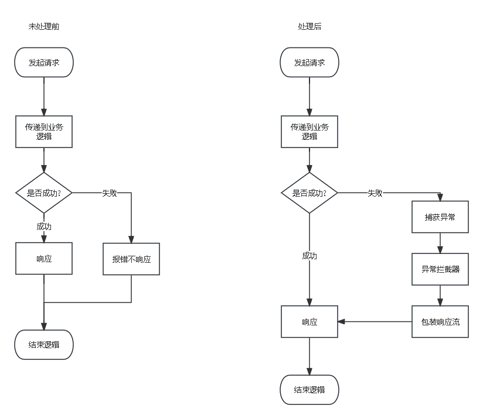

# 考试管理系统设计总结

# 目录

- [考试管理系统设计总结](#考试管理系统设计总结)
- [目录](#目录)
- [一、背景](#一背景)
- [二、为什么要开发](#二为什么要开发) - [1. 旧项目的不足](#1-旧项目的不足) - [2. 新项目优势](#2-新项目优势) - [3.新项目不足点](#3新项目不足点)
- [三、后续计划](#三后续计划)
- [四、项目开源地址](#四项目开源地址)

# 一、背景

主要来源于[教务管理系统]()，在 2022 年的 7 月 22 日，我完成了对教务管理系统 2 代的开发，在当时采用了 SpringCloud 的微服务技术，将整个项目拆分成了几个模块

# 二、为什么要开发

### 1. 旧项目的不足

如果教务管理系统有幸被你看见并使用，你就会发现该系统存在很多不足之处：

1. 采用分布式架构，导致项目部署更加困难，在同台服务器上需同时部署多台 Web 服务器；
2. 对配置要求高，项目一旦启动，将占用大量 CPU 和内存，如果仅使用一台服务器，很难跑起来；
3. 维护困难，项目由于采用了分布式，你需要确保每个模块都能准确无误的运行起来，一旦出现一个模块报错或卡死，另一个模块也会报错，引起雪崩，虽然有 Nacos 的调节，但由于在一台机器上，模块没有可替代的部分，这也是该项目一直未更新的原因；
4. 无法统一管理，模块间相互调用，各司其职，配置文件及公有部分无法实现完全的统一管理；
5. 市场需求，对于个人开发者，你只需负责单个模块的开发，分布式项目需要团队协作，且要求很高

综上所述，为了能尽量控制内存占用，同时减轻维护压力，现将使用 SpringBoot 作为核心开发框架，项目将作为单体项目运行

### 2. 新项目优势

考试管理系统，摈弃了之前的开发逻辑和模块处理，增加了很多技术点：

1. SpringSecurity 的权限管理机制，每个后端接口有着对应的权限，并且实现了动态权限管理机制，项目权限已经分明准确

   ```java
   //创建配置对象
           Collection<ConfigAttribute> collection = new HashSet<>();
           //获取当前访问的URL
           FilterInvocation invocation = (FilterInvocation) object;
           //获取请求方式
           String method = invocation.getHttpRequest().getMethod();
           String url = invocation.getRequestUrl();
           //加工url，去除参数
           if (url.contains("?")) {
               url = url.substring(0, url.lastIndexOf("?"));
           }
           log.info("当前请求路由:{}", url);
           //查找后端的路由
           Router router = new Router();
           router.setValue(url);
           router.setType(0);
           router.setMethod(method);
           //通过业务层查询路由对应的ID
           JsonRequest<List<Router>> request = routerService.lookRouter(router);
           //判断权限是否查询完成
           if (!request.getSuccess()) {
               log.error("未找到任何权限!");
               throw new ServiceException(RequestException.UNAUTHORIZED);
           }
           // 拿到路由菜单
           List<Router> routers = request.getData();
           //获得ID值
           String[] routerIds = routers
                   .stream()
                   .map(Router::getId)//提取ID值
                   .toArray(String[]::new);//转换为数组
           //获得权限ID
           JsonRequest<List<PermissionRouter>> request1 = permissionRouterService.lookPermissionRouterByRouter(routerIds);
           if (!request1.getSuccess()) {
               log.error("未找到任何权限!");
               throw new ServiceException(RequestException.UNAUTHORIZED);
           }
           // 获取权限ID
           String[] ids = request1.getData()
                   .stream()
                   .map(PermissionRouter::getPermissionId)//从中获取权限ID
                   .toArray(String[]::new);//转换为数组
           //最终获得权限菜单
           JsonRequest<List<Permission>> jsonRequest = permissionService
                   .lookPermissionById(ids);
           if (!jsonRequest.getSuccess()) {
               log.error("未找到任何权限!");
               throw new ServiceException(RequestException.UNAUTHORIZED);
           }
           //加入配置菜单
           jsonRequest.getData()
                   .forEach(v -> collection
                           .add(new SecurityConfig(v.getSign())));
           log.info("动态权限配置完成!");
           return collection;
   ```

2. 前后端分离，JWT 令牌机制，后端向前端发送 token，前端根据 token 判断用户是否登录

   后端

   ```java
   //获取请求头中的token
           String token = request.getHeader("token");
           if (!StringUtils.hasText(token)) {
               log.warn("token为空!");
               filterChain.doFilter(request, response);
           }
           //获取token中的ID
           String id = TokenUtils.checkToken(token).get("user").toString();
           String user = redisClientsUtils.get("login:" + id);
           //转换为对象
           UserDetail user1 = JSON.parseObject(user, UserDetail.class);
           //验证不通过或者redis数据库中不存在此数据
           if (!(StringUtils.hasText(user) || id.equals(user1.getUser().getId()))) {
               log.error("token验证失败!{}-{}", id, user);
               throw new ServiceException(RequestException.FORBIDDEN);
           }
           //存入ID
           SqlDateUtils.currentUserId = id;
           log.info("ID为{}用户通过验证!", id);
           //存入
           UsernamePasswordAuthenticationToken ut = new UsernamePasswordAuthenticationToken(
                   user1, null, user1.getAuthorities());
           //将权限信息放入SecurityContextHolder
           SecurityContextHolder.getContext().setAuthentication(ut);
           filterChain.doFilter(request, response);
   ```

   前端

   ```js
   // 用户登录
     login({commit}, userInfo) {
       const {username, password} = userInfo;
       return new Promise((resolve, reject) => {
         login({username: username.trim(), password: password})
           .then((response) => {
             const {data} = response;
             //存入token
             commit("SET_TOKEN", data);
             setToken(data);
             resolve();
           })
           .catch((error) => {
             reject(error);
           });
       });
     },
   ```

3. 异常处理机制

   后端异常处理机制流程如下:

   

   其中，异常拦截器由 SpringSecurity 自动处理，后端实现了一个统一的响应对象 JsonRequest

   ```java
   /**
    * JSON返回类
    * <p>
    * 此类用于向前端返回统一的JSON格式，具体分以下几个部分:
    * <ul>
    *     <li>status:状态码，错误的唯一标识，可以是自定义的，也可以是WEB规定的，可参阅{@link org.springframework.http.HttpStatus}</li>
    *      <li>message:消息，向客户端或服务端描述错误的原因</li>
    *      <li>success:是否成功，描述一个请求是否成功，也用于客户端或服务端判断</li>
    *      <li>data:具体的数据，整个请求的核心，可存放任意类型的数据，需要配合泛型</li>
    * </ul>
    *
    * @author by 春风能解释
    * <p>
    * 2023/6/30
    */
   @Data
   @NoArgsConstructor
   @ApiModel(value = "统一响应类", description = "用于传给前端的统一JSON格式")
   @Slf4j
   public class JsonRequest<T> implements Serializable {
       /**
        * 序列化字段
        */
       @ApiModelProperty(value = "序列化字段", hidden = true)
       private static final long serialVersionUID = -5408366163757792606L;
       /**
        * 错误代码
        */
       @ApiModelProperty(value = "错误代码", allowableValues = "range[100,511]")
       private Integer status = 200;
       /**
        * 消息
        */
       @ApiModelProperty(value = "消息")
       private String message = "请求已成功!";
       /**
        * 是否正常
        */
       @ApiModelProperty(value = "是否正常")
       private Boolean success = true;
       /**
        * 数据
        */
       @ApiModelProperty(value = "数据", allowEmptyValue = true)
       private T data = null;

       /**
        * 构造方法1
        *
        * @param data 数据
        */
       public JsonRequest(T data) {
           this.data = data;
       }

       /**
        * 构造方法2
        *
        * @param status  状态
        * @param message 消息
        * @param success 是否正常
        */
       public JsonRequest(Integer status, String message, Boolean success) {
           this.status = status;
           this.message = message;
           this.success = success;
       }

       /**
        * 成功请求
        *
        * @param data 数据
        * @param <T>  类型
        * @return JSON
        */
       public static <T> JsonRequest<T> success(T data) {
           return new JsonRequest<>(data);
       }

       /**
        * 错误请求
        *
        * @param e   异常
        * @param <T> 类型
        * @return JSON
        */
       public static <T> JsonRequest<T> error(RequestException e) {
           return new JsonRequest<>(e.getStatus(), e.getMessage(), false);
       }

       /**
        * 全局异常处理
        *
        * @param <T> 类型
        * @param e   异常
        * @return JSON
        */
       public static <T> JsonRequest<T> error(Exception e) {
           //如果是已定义的异常
           if (e instanceof ServiceException) {
               ServiceException exception = (ServiceException) e;
               return new JsonRequest<>(exception.getStatus(), e.getMessage(), false);
           }
           //其他的未知异常
           return new JsonRequest<>(500, e.getLocalizedMessage(), false);
       }
   }

   ```

   通过将此类，所有的响应（包括异常），都将变为

   ```json
   {
     "status": 200, //状态码
     "message": "", //消息
     "data": {}, //数据
     "success": true //是否成功
   }
   ```

   怎么样？是不是看起来很舒服。那么是由谁来捕获的?

   在之前的项目中，我们可以通过 SpringBoot 的`@ControllerAdvice`注解加上`@ExceptionHandler`实现，但由于 SpringSecurity 异常拦截器的底层是通过 Filter 来实现的，导致 SpringBoot 的拦截器在还没有拦截之前就被 SpringSecurity 处理，所以，我们提供了一个更底层的异常处理类

   ```java
   /**
    * 全局异常处理器
    * <p>
    * 此类用于处理大部分异常信息的响应,经过了这个类的处理,返回的格式将统一变为
    * <p>
    * {<p>
    * "success": false,<p>
    * "message": "信息!",<p>
    * "status": 状态<p>
    * }<p>
    * 此响应类可参照{@link com.chunfeng.result.JsonRequest}的字段
    *
    * @author by 春风能解释
    * <p>
    * 2023/8/4
    */
   @Component
   @Slf4j
   public class ExceptionHandler extends DefaultErrorAttributes {

       /**
        * 异常信息
        */
       private Exception exception = new ServiceException(RequestException.UNKNOWN_EXCEPTION);

       /**
        * 自定义错误返回
        *
        * @param webRequest 当前请求
        * @param options    错误上下文
        * @return JSON
        */
       @Override
       public Map<String, Object> getErrorAttributes(WebRequest webRequest, ErrorAttributeOptions options) {
           //初始化异常
           super.getErrorAttributes(webRequest, options);
           //获取对应的JSON字符串
           JsonRequest<Void> request = JsonRequest.error(exception);
           //先转换为JSON
           String jsonString = JSON.toJSONString(request);
           log.warn("全局异常处理类已捕获到异常:{}", request.getMessage());
           //再转换为Map对象
           return JSON.parseObject(jsonString, Map.class);
       }

       /**
        * 获取异常信息
        *
        * @param webRequest 当前请求
        * @return 异常
        */
       @Override
       public Throwable getError(WebRequest webRequest) {
           //获取异常信息
           Throwable error = super.getError(webRequest);
           if (error instanceof Exception) {
               this.exception = (Exception) error;
           }
           return error;
       }
   }

   ```

   这样，通过此类，所有的异常将都会经过这个过滤器，通过`getErrorAttributes()`方法响应 JSON

4. 自定义异常

   之前的项目，我继承`RuntimeException`实现了很多子类异常，然后进行抛出，但这样难免过于繁琐，此项目采用了新的自定义异常机制

   ```java
   /**
    * 业务层异常超类
    * <p>
    * 此异常为自定义异常的超类，用于描述各类业务异常，仅作容器使用，可配合RequestException使用，详情请见{@link com.chunfeng.result.RequestException}
    *
    * @author by 春风能解释
    * <p>
    * 2023/7/14
    */
   @Setter
   @Getter
   @NoArgsConstructor
   public class ServiceException extends RuntimeException {
       /**
        * 序列化字段
        */
       private static final long serialVersionUID = 456372299927265329L;
       /**
        * 错误代码
        */
       private Integer status = 500;
       /**
        * 消息
        */
       private String message = "未知异常!";

       /**
        * 使用原有枚举类异常
        *
        * @param requestException 异常枚举
        */
       public ServiceException(RequestException requestException) {
           super(requestException.getMessage());
           this.message = requestException.getMessage();
           this.status = requestException.getStatus();
       }

       /**
        * 通用构造
        *
        * @param message 消息
        */
       public ServiceException(String message) {
           super(message);
       }

       /**
        * 通用构造
        *
        * @param message 消息
        * @param cause   原因
        */
       public ServiceException(String message, Throwable cause) {
           super(message, cause);
       }

       /**
        * 通用构造
        *
        * @param cause 原因
        */
       public ServiceException(Throwable cause) {
           super(cause);
       }

       /**
        * 通用构造
        *
        * @param message            消息
        * @param cause              原因
        * @param enableSuppression  启用抑制
        * @param writableStackTrace 可写堆栈跟踪
        */
       public ServiceException(String message, Throwable cause, boolean enableSuppression, boolean writableStackTrace) {
           super(message, cause, enableSuppression, writableStackTrace);
       }
   }
   ```

   其中最重要的方法是`ServiceException(RequestException requestException)`方法，这个方法传递了一个枚举类

   ```java
   /**
    * 请求异常的枚举
    * <p>
    * 用于枚举业务层所有的异常(可扩展)，一个枚举包含两个部分，状态码+消息:
    * <br>
    * <ul>
    * <li>错误的唯一标识，可以是自定义的，也可以是WEB规定的，可参阅{@link org.springframework.http.HttpStatus}</li>
    * <li>消息用于向客户端或服务端描述问题的原因或具体情况，可根据实际业务需要进行设置</li>
    * </ul>
    *
    * @author by 春风能解释
    * <p>
    * 2023/6/30
    */
   @Getter
   @AllArgsConstructor
   public enum RequestException {
       /**
        * 非法访问
        */
       UNAUTHORIZED(401, "非法访问!"),
       /**
        * 登录失败
        */
       LOGIN_ERROR(402, "登录失败,请检查用户名或密码是否正确!"),
       /**
        * 非法授权
        */
       FORBIDDEN(403, "非法授权!"),
       /**
        * 找不到资源
        */
       NOT_FOUND(404, "找不到资源!"),
       /**
        * 注册失败
        */
       REGISTER_ERROR(405, "注册失败,请检查数据是否符合规范!"),
       /**
        * 退出登录失败
        */
       LOGOUT_ERROR(406, "退出登录失败!"),
       /**
        * 未知异常
        */
       UNKNOWN_EXCEPTION(500, "未知错误,请联系网站管理员!"),
       /**
        * 查询数据时遇到问题
        */
       SELECT_ERROR(501, "数据查询失败!"),
       /**
        * 添加数据时遇到问题
        */
       INSERT_ERROR(502, "数据添加失败!"),
       /**
        * 修改数据时遇到问题
        */
       UPDATE_ERROR(503, "数据修改失败!"),
       /**
        * 删除数据时遇到问题
        */
       DELETE_ERROR(504, "数据删除失败!"),
       /**
        * 文件上传失败
        */
       FILE_ERROR(505, "文件上传失败!"),
       /**
        * 文件超出范围
        */
       FILE_BEYOND_MAX_SIZE(506, "文件超出范围!"),
       /**
        * token异常
        */
       TOKEN_ERROR(507, "非法token");
       /**
        * 错误代码
        */
       private Integer status;
       /**
        * 消息
        */
       private String message;
   }
   ```

   这个枚举类是整个异常的核心，它负责定义异常，通过获取异常的状态码和消息，我们只需按下列方式抛出异常:

   ```java
   throw new ServiceException(RequestException.FORBIDDEN);
   ```

   这样，既同步了 JSON 格式，也可以方便维护和管理，同时，JsonRequest 在返回时也可调用

   ```java
   return JsonRequest.error(RequestException.UPDATE_ERROR);
   ```

5. 事务处理机制

   在通常的开发中，我们经常会使用`@Transactional`来处理事务，但仅局限于异常抛出时，如果遇到这种情况，则会导致失败:

   ```java
       /**
        * 新增一条年级信息
        *
        * @param gradle 年级信息
        * @return JSON
        */
       @Override
       @CacheEvict(value = "gradle_select", allEntries = true)
       public JsonRequest<Integer> addOneGradle(Gradle gradle) {
           //日志信息
           gradle.setId(UIDCreateUtil.getUUId());
           gradle.setCreateUser(SqlDateUtils.currentUserId);
           gradle.setCreateTime(SqlDateUtils.date);
           Integer column = gradleMapper.insertGradle(gradle);
           //判断添加是否成功
           if (column < 1) {
               //这里如果仍采用@Transactional，则不会触发回滚，但实际上这里需要回滚
               log.error("添加年级名为{}的数据失败!", gradle.getName());
               return JsonRequest.error(RequestException.INSERT_ERROR);
           }
           log.info("已向数据库添加名为{}的年级信息!", gradle.getName());
           return JsonRequest.success(column);
       }
   ```

   有人又要问了，有了`ServiceException`为什么不直接抛出？因为这里是为了规范业务层逻辑

   所以需要自定义事务处理，这里采用 AOP 处理机制

   ```java
   /**
    * 全局事务处理
    * <p>
    * 用于配置Spring事务机制，该配置采用了AOP切面编程思想
    *
    * @author by 春风能解释
    * <p>
    * 2023/8/1
    */
   @Aspect
   @Configuration
   @EnableAspectJAutoProxy
   @Slf4j
   public class TransactionalConfig {

       /**
        * 事务管理器
        */
       @Autowired
       private DataSourceTransactionManager transactionManager;

       /**
        * 排除切入点
        */
       @Pointcut("!@annotation(com.chunfeng.note.ExcludeMethods)")
       private void excludeMethods() {
       }

       /**
        * 排除切入点
        */
       @Pointcut("!execution(* com.chunfeng.service.impl.*.look*(..))")
       private void lookMethods() {
       }

       /**
        * 业务切入点
        */
       @Pointcut("execution(* com.chunfeng.service.impl.*.*(..))")
       private void serviceMethods() {
       }

       /**
        * 最终切入点
        */
       @Pointcut("serviceMethods()&&lookMethods()&&excludeMethods()")
       private void method() {
       }

       /**
        * 执行逻辑
        *
        * @param pjp 方法对象
        * @return 方法返回值
        */
       @Around("method()")
       private Object Transaction(ProceedingJoinPoint pjp) {
           //初始化事务处理
           DefaultTransactionDefinition definition = new DefaultTransactionDefinition();
           definition.setPropagationBehaviorName("PROPAGATION_REQUIRED");
           TransactionStatus status = transactionManager.getTransaction(definition);
           log.info("事务处理器初始化完成!");
           //执行逻辑
           Object proceed;
           try {
               proceed = pjp.proceed();
           } catch (Throwable throwable) {
               log.error("方法发生异常,事务回滚触发!原因:{}", throwable.getLocalizedMessage());
               //回滚事务
               transactionManager.rollback(status);
               return null;
           }
           //获取返回值
           JsonRequest<?> result;
           //判断返回类型
           if (!(proceed instanceof JsonRequest)) {
               // 提交事务
               log.warn("方法返回值不是JSON类型,提交事务触发!");
               transactionManager.commit(status);
               return proceed;
           }
           //将返回值转换为实际的
           result = (JsonRequest<?>) proceed;
           //判断JSON数据是否错误
           if (!result.getSuccess()) {
               log.error("方法执行出错,事务回滚触发!");
               transactionManager.rollback(status);
               return proceed;
           }
           log.info("方法执行成功,提交事务触发!");
           // 提交事务
           transactionManager.commit(status);
           return proceed;
       }
   }
   ```

   这里还提到了一个注解`@ExcludeMethods`，这个注解定义如下:

   ```java
   /**
    * 事务排除方法
    * <p>
    * 凡是在业务方法上标有此注解的，都不会执行事务功能
    *
    * @author by 春风能解释
    * <p>
    * 2023/8/2
    */
   @Documented
   @Retention(RetentionPolicy.RUNTIME)
   @Target({ElementType.METHOD})
   public @interface ExcludeMethods {

   }
   ```

   这里是我自定义的注解，用于排除某些特定的方法，例如登录`login()`

   该注解标识的方法都将不参与事务处理:

   ```java

       /**
        * 登录逻辑
        *
        * @param name     用户名
        * @param password 密码
        * @return JSON
        */
       @Override
   	//不参与AOP
       @ExcludeMethods
       public JsonRequest<String> login(String name, String password) {
           //获取UserDetail对象
           UsernamePasswordAuthenticationToken userToken = new UsernamePasswordAuthenticationToken(name, password);
           Authentication authenticate = authenticationManager.authenticate(userToken);
           UserDetail userDetail = (UserDetail) authenticate.getPrincipal();
           if (Objects.isNull(userDetail)) {
               log.error("用户名为{}的用户登陆失败!原因:用户名或密码错误!", name);
               return JsonRequest.error(RequestException.LOGIN_ERROR);
           }
           //获取用户实际对象
           User user = userDetail.getUser();
           //生成token对象
           String token = TokenUtils.createToken(user.getId());
           //将用户信息存入Redis数据库
           redisClientsUtils.set(
                   "login:" + user.getId(), //key: login:2(数字代表ID)
                   JSON.toJSONString(userDetail));//value: 用户序列化后的字符串
           log.info("用户{}登录成功!", name);
           return JsonRequest.success(token);
       }
   ```

   这样，当`JsonRequest`返回错误请求时，事务将会回滚，并且也摈弃了每个业务层实现类都要加入`@Transactional`

6. 文件处理类

   ```java
   /**
    * 全局文件操作类
    *
    * @author by 春风能解释
    * <p>
    * 2023/7/20
    */
   @Slf4j
   public class FileMangerUtils<T> {

       /**
        * 文件配置
        */
       @Autowired
       private FileConfigProperties fileConfigProperties;

       /**
        * 写入文件操作
        *
        * @param fileName 文件名
        * @param obj      待序列化的对象
        * @return 文件路径
        */
       public String fileWriter(String fileName, T obj) {
           ObjectOutputStream ois;
           try {
               //初始化序列化对象
               ois = new ObjectOutputStream(Files.newOutputStream(Paths.get(fileConfigProperties.getUrl() + fileName)));
               //写入文件
               ois.writeObject(obj);
           } catch (Exception e) {
               log.error("写入文件{}失败!", fileName);
               throw new ServiceException(RequestException.FILE_ERROR);
           }
           //释放资源
           close(null, ois);
           log.info("已创建文件{}", fileName);
           return fileConfigProperties.getUrl() + fileName;
       }

       /**
        * 文件修改操作
        *
        * @param fileName 文件名
        * @param obj      待序列化的对象
        */
       public void fileUpdate(String fileName, T obj) {
           File file = new File(fileConfigProperties.getUrl() + fileName);
           //如果文件不存在
           if (!file.exists()) {
               log.warn("文件{}不存在!", fileName);
               throw new ServiceException(RequestException.FILE_ERROR);
           }
           String path = fileWriter(fileName, obj);
           log.info("文件{}修改完成!", path);
       }

       /**
        * 文件查看操作
        *
        * @param fileName 待查看的文件名
        * @return T 返回反序后的对象
        */
       public T fileLook(String fileName) {
           //读文件
           ObjectInputStream ois;
           T obj;
           try {
               ois = new ObjectInputStream(Files.newInputStream(Paths.get(fileConfigProperties.getUrl() + fileName)));
               //转换为指定对象
               obj = (T) ois.readObject();
           } catch (Exception exception) {
               log.error("文件{}读取失败!", fileName);
               throw new ServiceException(RequestException.FILE_ERROR);
           }
           log.info("文件{}已成功读取!", fileName);
           //释放资源
           close(ois, null);
           return obj;
       }

       /**
        * 删除文件
        *
        * @param fileName 待删除的文件名
        */
       public void fileDelete(String fileName) {
           File file = new File(fileConfigProperties.getUrl() + fileName);
           if (file.exists()) {
               log.info("文件{}已被删除!", fileName);
               file.delete();
           }
           log.warn("文件{}不存在!", fileName);
       }

       /**
        * 文件下载
        *
        * @param fileName 文件名
        * @return 文件响应流
        */
       public ResponseEntity<Resource> avatarDownload(String fileName) {
           ResourceLoader loader = new DefaultResourceLoader();
           if (fileName.equals("0")) {
               log.warn("该用户未设置头像,输出默认头像");
               return ResponseEntity.ok(loader.getResource("file:" + fileConfigProperties.getUrl() + fileConfigProperties.getDefaultFile()));
           }
           File file = new File(fileConfigProperties.getUrl() + fileName);
           //文件不存在
           if (!file.exists()) {
               log.warn("找不到图片{}", fileName);
               return ResponseEntity.notFound().build();
           }
           log.info("已找到{}", fileName);
           //获取当前文件
           return ResponseEntity.ok(loader.getResource("file:" + fileConfigProperties.getUrl() + fileName));
       }

       /**
        * 文件上传
        *
        * @param file     待上传文件
        * @param fileName 文件名
        * @return 是否成功
        */
       public Boolean avatarUpload(MultipartFile file, String fileName) {
           File old = new File(fileConfigProperties.getUrl() + fileName);
           //判断源文件是否存在
           if (old.exists()) {
               //删除文件避免重复
               fileDelete(fileName);
           }
           if (file.isEmpty()) {
               log.error("待上传的文件为空!");
               throw new ServiceException(RequestException.FILE_ERROR);
           }
           long size = file.getSize();
           // 判断文件大小
           if (size > fileConfigProperties.getFileMaxSize() * 1024 * 1024) {
               log.warn("文件大小超出限制!实际大小:{}", size);
               throw new ServiceException(RequestException.FILE_BEYOND_MAX_SIZE);
           }
           //上传文件
           try {
               file.transferTo(new File(fileConfigProperties.getUrl() + fileName));
           } catch (IOException ioException) {
               log.error("头像上传失败!");
               throw new ServiceException(RequestException.FILE_ERROR);
           }
           log.info("文件{}上传成功!", fileName);
           return true;
       }

       /**
        * 释放资源
        *
        * @param ois 输入流对象
        * @param ops 输出流对象
        */
       public void close(InputStream ois, OutputStream ops) {
           try {
               //释放资源
               if (ois != null) {
                   log.info("已释放InputStream");
                   ois.close();
               }
               if (ops != null) {
                   log.info("已释放OutputStream");
                   ops.close();
               }
           } catch (IOException ioException) {
               log.error("释放资源失败!");
               throw new ServiceException(RequestException.FILE_ERROR);
           }
       }
   }
   ```

   这里定义了一个文件操作类，用于统一处理文件流，具体可参阅项目业务代码

当然还有很多，目前只整理出以上几点，具体请参阅项目源代码

### 3.新项目不足点

1. 业务层出现了大量日志输出，没有将业务完全分离；
2. 项目代码赘余比较严重，没有统一管理；
3. 项目实际上并未严格按照企业的开发风格，一些代码还可以更好的调整；

还有很多不足，欢迎广大开发者指正和建议

# 三、后续计划

由于项目目前还处于开发阶段，后期还可能添加新功能，具体如下：

1. 完成用户端的前端页面
2. 如果时间充沛，可以尝试将项目拆成分布式
3. 写一个项目的 PPT 介绍文档

目前精力有限，只能暂时制定这些计划，如果你有更好的建议，欢迎提供！

# 四、项目开源地址

Gitee:[考试管理系统](https://gitee.com/cfnjs20020602/EMSystem)

GitHub:[2516649281/EMSystem](https://github.com/2516649281/EMSystem)
